# FundamentosCD

# Fundamentos de datos
## actividades practicas

en el siguiente readme dejamos la informacion del projecto 

Linda Marcela Villamil Ortigoza 

DBanner: 100173668

Luis Fernando Montero Castro 

IDBanner: 100164000

Corporación Universitaria Iberoamericana 

Ingeniería de Ciencia de Datos


# Actividad 3 parte1

Ciencia de datos en acción - Fase 1 (Practicando con R)
El objetivo de esta actividad es realizar algunas actividades prácticas que permitan
identificar patrones y realizar análisis en conjuntos de datos con RStudio. Se espera que los
estudiantes al desarrollar estos ejercicios, se motive a expandir las posibilidades que ofrece
la herramienta y amplíe los conceptos trabajados en el curso


## Ejercicio 1
Cada grupo de estudiantes debe crear un conjunto de datos de 30 estudiantes de un curso
de Fundamentos de ciencia de datos, los datos que se deben relacionar por cada estudiante
son:
● Sexo
● Edad,
● Estatura
● Nota
● Ciudad
Con estos datos y usando la herramienta RStudio cada grupo debe:


### 1 Realizar una tabla de frecuencias absolutas y otra de frecuencias relativas para la
### variable Calificación. Almacena las tablas anteriores en dos variables y llámalas
### absolutas y relativas.


## frecuencias absolutas
```R
#Calcular la tabla de frecuencias absolutas para la variable Calificación
absolutas <- table(df$Nota)
print(absolutas) 
```
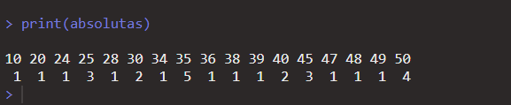

## frecuencias relativas
```R
calcular la tabla de frecuencias relativas para la variable nota.
relativas <- prop.table(table(df$Nota))
relativas
```
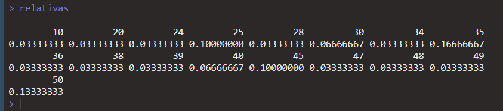


### 2. Representar la variable ciudad mediante un diagrama de barras y un diagrama de
### sectores. Incluye un título adecuado para cada gráfico y colorea las barras y los
### sectores de colores diferentes.


## Diagrama de barras
```R
    barras <- ggplot(df, aes(x = Ciudad, fill = Ciudad)) +
    geom_bar() +
     labs(title = "Diagrama de Barras - Ciudad") +
    theme_minimal()

barras   
```
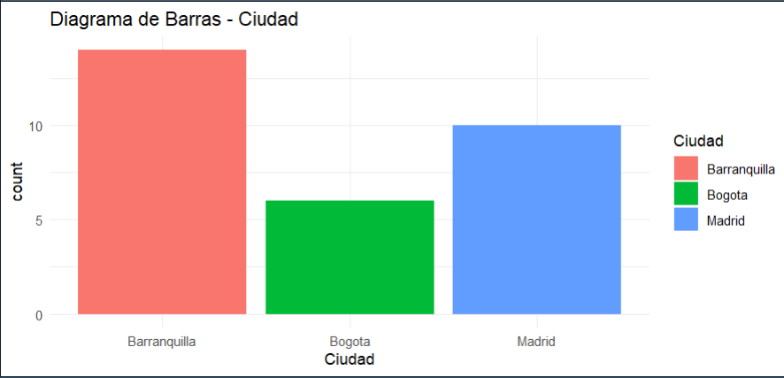

## Diagrama por sectores
```R
sectores <- ggplot(df , aes(x = "", fill = Ciudad)) +
    geom_bar(width = 1) +
    coord_polar(theta = "y") +
    labs(title = "Diagrama de Sectores - Ciudad") +
    theme_void()

sectores
```
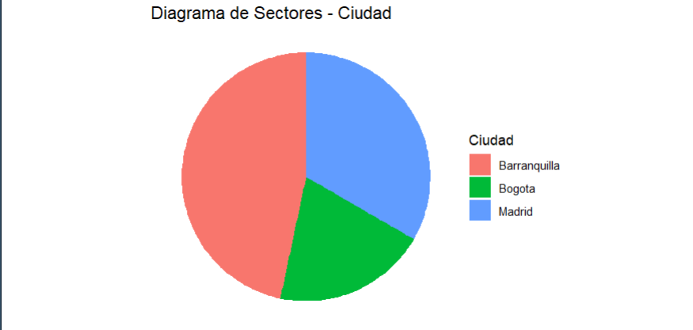


### 3.Para la variable Edad, realizar un histograma y un diagrama de caja y bigotes
### considerando la opción range = 1.5. Incluye un título apropiado para cada gráfico y
### colorea las barras del histograma de color amarillo. ¿Existe algún valor atípico en
### esta variable? Reduce el valor del argumento range hasta 0.5. ¿Varían las
### conclusiones?


```R
histograma_1_5 <- ggplot(df, aes(x = Edad, fill = "Edad")) +
    geom_histogram(binwidth = 1, color = "black", fill = "yellow") +
    labs(title = "Histograma de Edad (Range = 1.5)", x = "Edad", y = "Frecuencia") +
    theme_minimal()

histograma_1_5
```
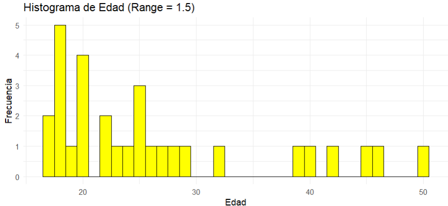


## caja de bigote range = 1.5
```R
#se ccrea la caja de bigote con rango 1.5
caja_bigotes_1_5 <- ggplot(df, aes(x = "", y = Edad, fill = "Edad")) +
    geom_boxplot() +
    labs(title = "Diagrama de Caja y Bigotes de Edad (Range = 1.5)", y = "Edad") +
    theme_minimal()

```
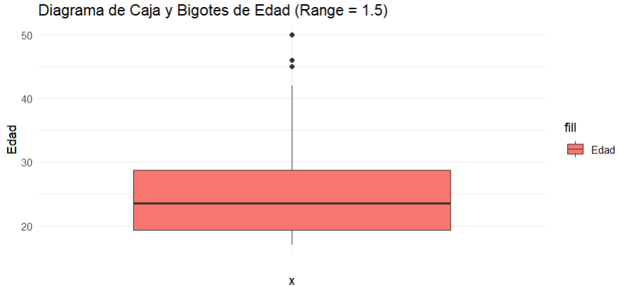


## caja y bigotes con range = 0.5+
```R
boxplot_5_ <- ggplot(df, aes(y=Edad)) +
  geom_boxplot()+
  labs(title = "Diagrama de caja y bigotes - range = 0.5", x="") +
  coord_cartesian(ylim = quantile(df$Edad, c(0.25, 0.75)) + 0.5 * IQR(df$Edad)) 
print(boxplot_5_)

print(boxplot_5_)
```
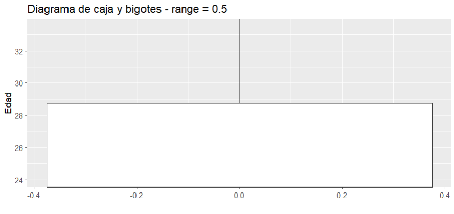


Se puede obervar que en la caja de bigotes de range 0.5 no se visualiza algunos datos lo cual no da imagen total de los datos.


### 4. Realizar un resumen de la variable Puntuación mediante la orden summary.
### Comprueba que las medidas que proporciona summary coinciden con las medidas
### calculadas de forma individual usando su función específica.

```R
summary(df)
``` 
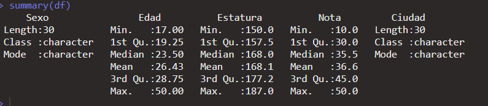
```R
mean(df$Nota)
median(df$Nota)
min(df$Nota)
max(df$Nota)
quantile(df$Nota, probs = c(0.25, 0.5, 0.75))

``` 
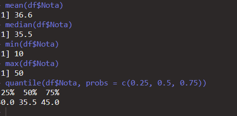

### 5. Calcular la estatura media de los estudiantes y proporcionar al menos, dos
### medidas que indiquen la dispersión de esta variable.

```R
mean(df$Estatura)
sd(df$Estatura)
IQR(df$Estatura)

```
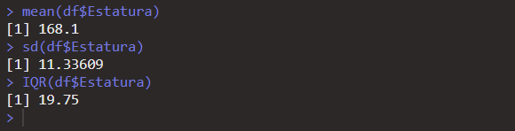


### 6. Finalmente se espera que el grupo presente las conclusiones a las que puede llegar
### con el desarrollo del taller.


## se llego a lassiguientes conclusiones de que en este conjunto de datos:

- la nota mas repetida en elcurso es la de 35 con 16 % de aparicion.

- la media de estatura eb el grupo es de 168.1.

- los estudiates viven en Barranquilla luego Madrid y bogota
siendo Barranquilla el que mas estudiantes poseen.

-  la edad mas recurrente en los estudiantes es de 18.

- la persona con mas edad del curso tiene 50 años.

- la persona mas alta del curso mide 1.87. 

- la persona mas pequeña del curso mide 1.50.

# Actividad 3 parte2


## Ejercicio 2

Cada grupo de estudiantes trabajará con dos grupos de datos (Gr1, Gr2) de 20 personas para un análisis de, los datos se comparten a continuación


### 1Representar la variable Grupo Sanguíneo mediante un diagrama de sectores en cada uno de los grupos. Incluir un título descriptivo en cada gráfico y colorear los sectores de azul, amarillo, rosa y verde.


```R
grupo_counts1 <- table(g1$Grupo.Sanguineo)


# Colores para cada grupo sanguíneo
colores <- c("#3366CC", "#FFD700", "#FF69B4", "#228B22")  # Azul, Amarillo, Rosa, Verde

df1 <- data.frame(grupo = names(grupo_counts1), count = as.numeric(grupo_counts1))

# Crear el gráfico de sectores con ggplot2

ggplot(df1, aes(x = "", y = count, fill = grupo)) +
    geom_bar(width = 1, stat = "identity", color = "black", size = 1.5, position = "fill") +
    coord_polar(theta = "y") +
        scale_fill_manual(values = colores) +
    labs(title = "Distribución de Grupo Sanguíneo") +
    theme_void() +
    theme(legend.position = "bottom",
        panel.border = element_rect(color = "black", fill = NA, size = 2),
        plot.title = element_text(hjust = 0.5, size = 16, face = "bold", margin = margin(b = 20)),
        plot.margin = margin(10, 10, 10, 10, unit = "pt"),
        plot.background = element_rect(fill = "white", color = "black", size = 1.5),
        panel.grid.minor = element_blank(),
        plot.caption = element_text(hjust = 0.5, size = 12, margin = margin(t = 10)))
grupo_counts <- table(g1$Grupo.Sanguineo)
```
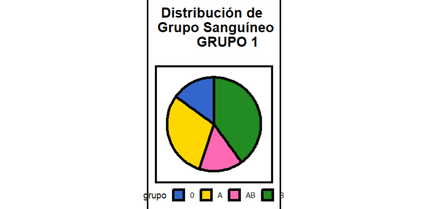


```R
grupo_counts2 <- table(g2$Grupo.Sanguineo)


df2 <- data.frame(grupo = names(grupo_counts2), count = as.numeric(grupo_counts2))

# Crear el gráfico de sectores con ggplot2
ggplot(df2, aes(x = "", y = count, fill = grupo)) +
  geom_bar(width = 1, stat = "identity", color = "black", size = 1.5, position = "fill") +
  coord_polar(theta = "y") +
  scale_fill_manual(values = colores) +
  labs(title = "Distribución de Grupo Sanguíneo") +
  theme_void() +
  theme(legend.position = "bottom",
        panel.border = element_rect(color = "black", fill = NA, size = 2),
        plot.title = element_text(hjust = 0.5, size = 16, face = "bold", margin = margin(b = 20)),
        plot.margin = margin(10, 10, 10, 10, unit = "pt"),
        plot.background = element_rect(fill = "white", color = "black", size = 1.5),
        panel.grid.minor = element_blank(),
        plot.caption = element_text(hjust = 0.5, size = 12, margin = margin(t = 10)))
```
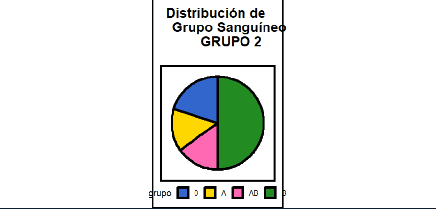


### 2. Representar la variable Estatura mediante un histograma en cada uno de los grupos.


```R
histograma_gr1 <- ggplot(g1, aes(x = Estatura)) +
  geom_histogram(fill = "skyblue", color = "black", bins = 10) +
  labs(title = "Histograma de Estatura - Grupo 1", x = "Estatura", y = "Frecuencia") +
  theme_minimal()
``` 
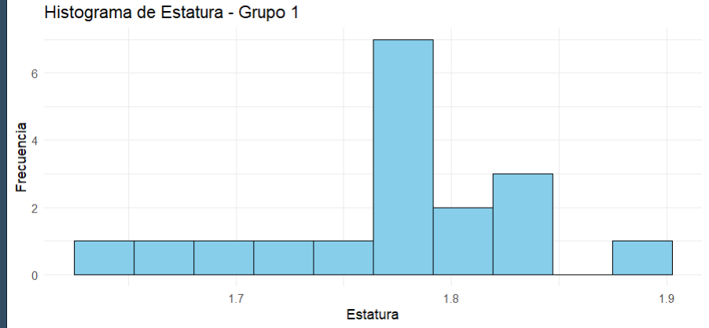

# Histograma para el grupo 2`
```R
histograma_gr2 <- ggplot(g2, aes(x = Estatura)) +
  geom_histogram(fill = "lightgreen", color = "black", bins = 10) +
  labs(title = "Histograma de Estatura - Grupo 2", x = "Estatura", y = "Frecuencia") +
  theme_minimal()

# Mostrar los histogramas
print(histograma_gr1)
print(histograma_gr2)
```
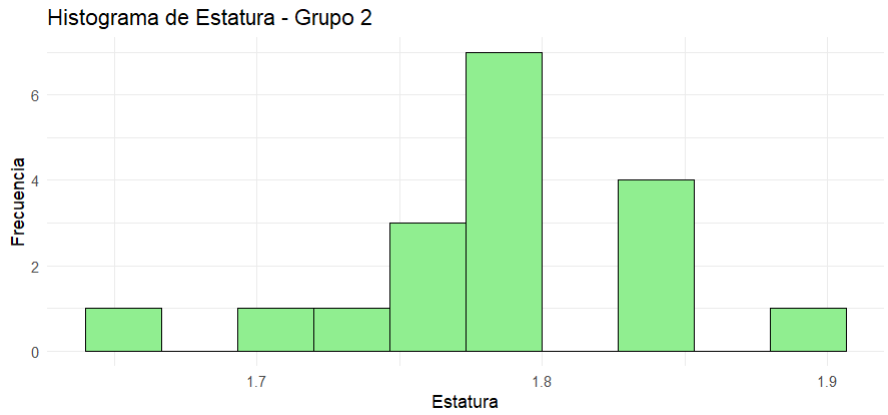


### 3. ¿Existe algún dato atípico en la variable Edad en el grupo A? ¿Y en el grupo B?

```R
# Crear diagrama de caja para Grupo 1 - Edad
boxplot_edad_g1 <- ggplot(g1, aes(x = "", y = Edad)) +
  geom_boxplot(fill = "skyblue") +
  labs(title = "Diagrama de Caja - Grupo 1 - Edad", x = "", y = "Edad") +
  theme_minimal()

# Mostrar los diagramas de caja
  print(boxplot_edad_g1)
```
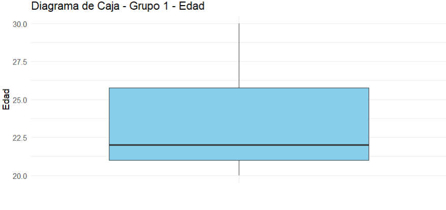

```R
# Crear diagrama de caja para Grupo 2 - Edad
boxplot_edad_g2 <- ggplot(g2, aes(x = "", y = Edad)) +
  geom_boxplot(fill = "lightgreen") +
  labs(title = "Diagrama de Caja - Grupo 2 - Edad", x = "", y = "Edad") +
  theme_minimal()

# Mostrar los diagramas de caja

print(boxplot_edad_g2)
```


#se observa que no hay datos atipicos (outliers) que afenten las mediciones


### 4. ¿Cuál es el valor máximo del 40% de las estaturas más pequeñas de los individuos en el grupo 1? ¿Y el valor mínimo del 30% de las estaturas mayores de los individuos en el grupo 2?


```R

# Calcular el valor máximo del 40% de las estaturas más pequeñas en el Grupo 1
maximog1 <- quantile(estaturas_gr1_ordenadas, 0.4, na.rm = TRUE)

maximog1
``` 
```R
# Calcular el valor mínimo del 30% de las estaturas mayores en el Grupo 2
minimog2 <- quantile(estaturas_gr2_ordenadas, 0.7, na.rm = TRUE)

minimog2

```


### 5. ¿Dónde son las variables edad y estatura más homogéneas: en el grupo A o en el B?

```R
hist(g1$Edad)

hist(g2$Edad)


hist.default(g1$Estatura)
hist(g2$Estatura)
```


### 6. ¿En qué grupo presentan los individuos una altura media mayor? ¿En qué grupo #presentan los individuos una altura mediana menor?
```r
media_altura_gr1 <- mean(g1$Estatura, na.rm = TRUE)
media_altura_gr2 <- mean(g2$Estatura, na.rm = TRUE)

mediana_altura_gr1 <- median(g1$Estatura, na.rm = TRUE)
mediana_altura_gr2 <- median(g2$Estatura, na.rm = TRUE)

# Mostrar los resultados
print(paste("Media de altura en Grupo 1:", media_altura_gr1))
print(paste("Media de altura en Grupo 2:", media_altura_gr2))

print(paste("Mediana de altura en Grupo 1:", mediana_altura_gr1))
print(paste("Mediana de altura en Grupo 2:", mediana_altura_gr2))
```


### 7. Estudia la asimetría y la curtosis de la variable Estatura en el grupo A.

```R
# Calcular la asimetría y la curtosis de la variable Estatura en el Grupo 1
asimetria_estatura_gr1 <- skewness(g1$Estatura, na.rm = TRUE)
curtosis_estatura_gr1 <- kurtosis(g1$Estatura, na.rm = TRUE)

# Mostrar los resultados
print(paste("Asimetría de Estatura en Grupo 1:", asimetria_estatura_gr1))
print(paste("Curtosis de Estatura en Grupo 1:", curtosis_estatura_gr1))

```


